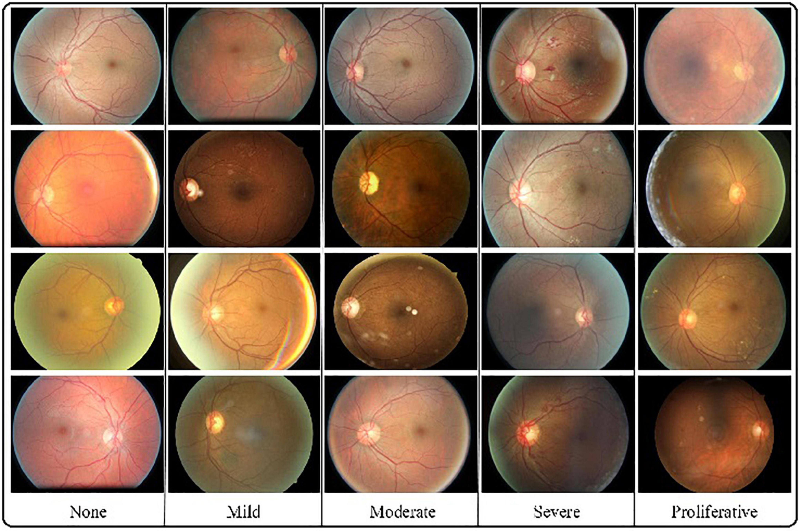

# Classification of Fundus Diabetic Retinopathy Images Using Deep Learning

## Introduction

Diabetic retinopathy is a leading cause of blindness among adults. Early detection through retinal imaging can prevent vision loss. This project leverages deep learning techniques to classify retinal images into different stages of diabetic retinopathy, enabling early diagnosis and treatment.

## Dataset

The dataset used for training and testing the models consists of retinal images labeled with different stages of diabetic retinopathy. This dataset can be obtained from the [Kaggle Diabetic Retinopathy Dataset](https://www.kaggle.com/datasets/sovitrath/diabetic-retinopathy-224x224-2019-data) or any other similar source.

- **Classes**: 
  - 0: No Diabetic Retinopathy
  - 1: Mild Diabetic Retinopathy
  - 2: Moderate Diabetic Retinopathy
  - 3: Severe Diabetic Retinopathy
  - 4: Proliferative Diabetic Retinopathy

## Model Architecture

The model architecture used for this project is based on CNN with ResNet-18.

## Requirements

- Python 3.7+
- PyTorch
- OpenCV
- Streamlit
  
## Dual Flow Architecture
- Streamlit-Based Deployment (Using full_model.pth)
- Training & Testing Module (Using train_test.py + new_model.pth)

